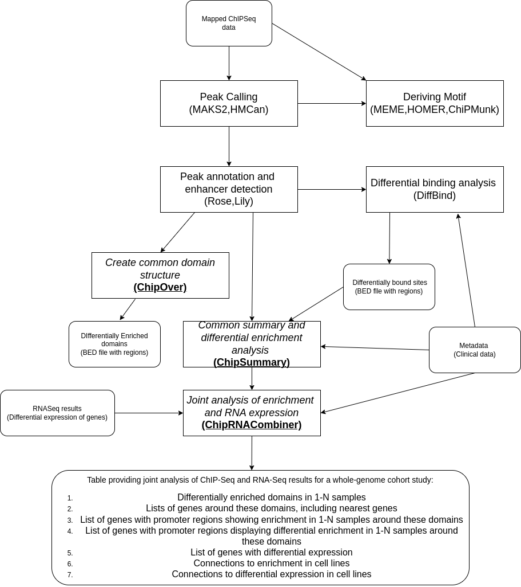

# chipover
A command-line toolkit for summarizing, analyzing, and interpreting ChIP-Seq and RNA-Seq experiments, designed for enhancer and super-enhancer region analysis in tumor-normal pairs, with applications in differential enrichment and multi-sample domain analysis. 

## Processing overview



## Installation

Before installing, ensure you have the following:

- **Python 3.9 or later**: [Download Python](https://www.python.org/downloads/)
- **Git**: [Download Git](https://git-scm.com/downloads)
- **Bash-like shell**: A shell environment for running commands. This could be Git Bash (Windows), Terminal (macOS), or any Linux shell.

```bash
# Clone the repository
git clone https://github.com/l0andr/chipover.git
# Navigate to the directory
cd chipover
# Install dependencies
pip install -r requirements.txt
```
